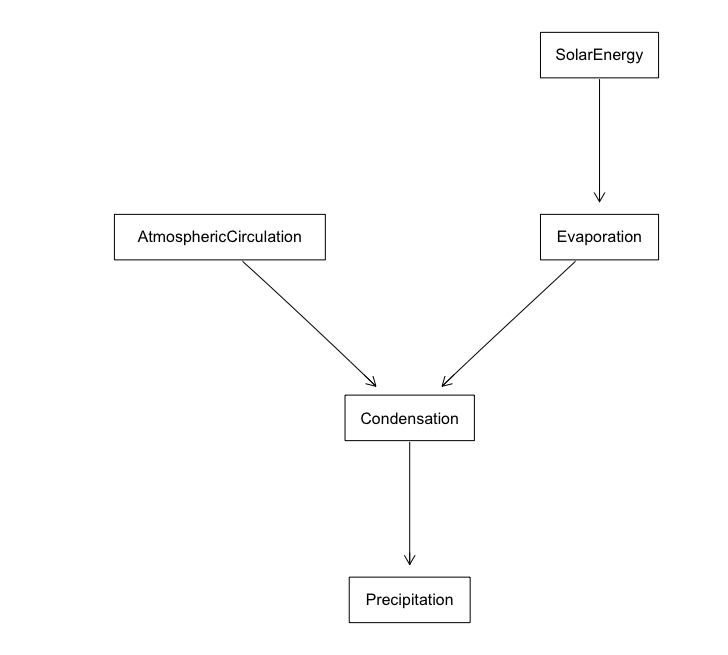
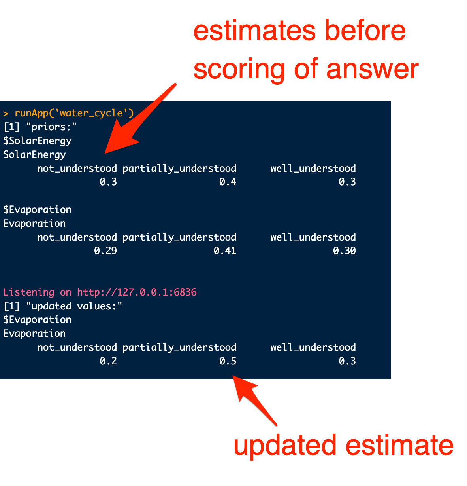

# Formative assessment using AI and Bayesian Networks

## Main idea

1. Student provides a long answer/short essay to a teacher question. 
2. The answer gets scored by chatGPT along with a verbal feedback aligned with the score. 
3. The score gets used to update a learner model, formally a Bayesian Network. 
4. The score, the comment, and the Learner Model go to the teacher.

This process includes the teacher "in the loop" (4), which, at least for school education, is necessary because teachers tend to know their students and how to talk to them. Step (3) refers to a technique and tool for information integration under uncertainty that  aligns with methods developed in educational measurement and assessment 
([Almond et al, 2015](https://link.springer.com/book/10.1007/978-1-4939-2125-6)). The method contributes to making formative assessment more than just feedback provision. Bayesian updating is the formally optimal way for decision making under uncertainty. 
 

## Early demonstrator
*Note:* This is functional, not a mockup. But very basic. 

### The learner model structure
Using the water cycle domain for illustration, a simple model involving just five concepts looks like so:

The model is a probabilistic one, meaning that the arrows are used to update probabilities according to the direction of the arrows based on new information on a student's performance. For details, see the "Network" part of [the app](https://github.com/prei007/formative-assessment/blob/main/water_cycle/app.R)

### Teacher UI

Student answers are sent to chatGPT for scoring and verbal feedback. Example:

**Student answer:** Solar energy is super important for the water cycle because it heats up the water in oceans, lakes, and rivers, making it evaporate into the air. This forms water vapor, which rises and cools down to create clouds. Without the sun, there wouldn’t be enough energy to make the water move around. I think the sun also helps with condensation because it warms the clouds, but I’m not entirely sure. Also, solar energy might make the wind blow, which pushes clouds around. So, the sun kind of powers everything in the water cycle, from evaporation to moving water around in the air

**chatGPT:** The student demonstrates some understanding of the role of solar energy in the water cycle, such as causing evaporation and potentially influencing wind patterns. However, there are some inaccuracies and gaps in understanding, such as the mention of condensation being caused by the sun warming clouds. Encourage the student to further clarify and expand on their understanding of how solar energy drives the water cycle. Score: partially_understood. 

### Learner model update
*Note:* This is functional, but not part of the web app yet. The model output goes to the console at the moment. 

Using the score returned by chatGPT, the priors in the Learner Model get updated. For this, the program scans the teacher question for a concept matching a node in the Learner Model and then updates this and the connected nodes in the model. In the example above, this would be the relation `SolarEnergy —> Evaporation`. The likelihood that Evaporation is understood by the student is updated based on the conditional probabilities provided when setting up the Learner Model. 

### Next steps
1. Make learner model persistent (store and retrieve from a database)
2. Visualise (updates to) the learner model in the UI
3. Generalise model-updating to multiple nodes (multiple facets of students' knowledge) based on a single input.
4. Improve UI 

### Software used

* RStudio as the development environment
* R and the packages
    * grain - for Bayesian Network modelling
    * openai - for communicating with chatGPT
    * Shiny - for creating the web app
    
