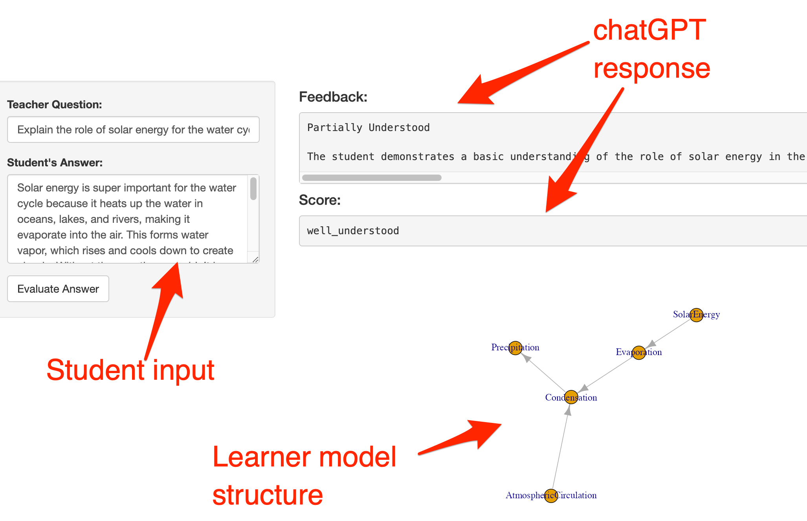

# Teachers supported by AI tools achieve formative assessment  

## Main idea

1. Student provides a long answer/short essay (or any other artefact) to a teacher question/prompt. 
2. ChatGPT (or another LLM) scores the work and provides verbal comments aligned with the score. 
3. The score gets used to update a persistent model of the learner, formally a Bayesian Network. 
4. The score, the comment, and the learner model go to the teacher, who considers these when assessing the student.
5. The teacher can prompt the AI further, provide more information to the model, and even change the structure of the model. 

Motivation: 
* Student-related information is stored and managed at the organisation level (a school, a university) because LLMs do not (and arguably should not) store information about a student over time. In this scenario, the LLM only knows about the single work artefact uploaded.
* This process includes the teacher "in the loop" (4), which, at least for school education, is necessary because teachers tend to know their students and how to talk to them.
* Bayesian learner modelling (3) is a technique for information integration under uncertainty that  aligns with methods developed in educational measurement and assessment ([Almond et al, 2015](https://link.springer.com/book/10.1007/978-1-4939-2125-6)). Formative assessment is more than just feedback provision: Bayesian updating is the formally optimal way for decision-making under uncertainty.
* Despite being formally optimal, Bayesian inference can go wrong because the model assumptions are (partially) wrong and/or not all relevant information is provided. Teachers can scrutinize the model, add information, and change its structure. 
 
## (Very) Early demonstrator
*Note:* While a web app, some of the output goes to the developer console at this early development stage. Also, the UI is entirely under-developed. We'll experiment down the road with ways to visualise probabilistic learner models, with work such as [Almond et al., 2009](https://www.sciencedirect.com/science/article/pii/S0888613X08000911) and [Zapata-Rivera, 2004](http://portal.acm.org/citation.cfm?id=1434859) in mind. So, in the not too far future it *might* look something like this, with colours and relative sizes denoting important diagnostic information: 

### The learner model structure
Using the water cycle domain for illustration, a simple model involving just five concepts looks like the network shown in the screenshot below.
The model is a probabilistic one, meaning that the arrows are used to update probabilities according to the direction of the arrows based on new information on a student's performance. For details, see the "Network" part of [the app](https://github.com/prei007/formative-assessment/blob/main/water_cycle/app.R). 

### Teacher UI
The app runs in a web browser. 

Student answers are sent to chatGPT for scoring and verbal feedback. Example:

**Student answer:** Solar energy is super important for the water cycle because it heats up the water in oceans, lakes, and rivers, making it evaporate into the air. This forms water vapor, which rises and cools down to create clouds. Without the sun, there wouldn’t be enough energy to make the water move around. I think the sun also helps with condensation because it warms the clouds, but I’m not entirely sure. Also, solar energy might make the wind blow, which pushes clouds around. So, the sun kind of powers everything in the water cycle, from evaporation to moving water around in the air

**chatGPT:** The student demonstrates some understanding of the role of solar energy in the water cycle, such as causing evaporation and potentially influencing wind patterns. However, there are some inaccuracies and gaps in understanding, such as the mention of condensation being caused by the sun warming clouds. Encourage the student to further clarify and expand on their understanding of how solar energy drives the water cycle. Score: partially_understood. 

### Learner model update
*Note:* This is functional, but not part of the web app yet. The model output goes to the console at the moment. 

Using the score returned by chatGPT, the priors in the Learner Model get updated. For this, the program scans the teacher question for a concept matching a node in the Learner Model and then updates this and the connected nodes in the model. In the example above, this would be the relation `SolarEnergy —> Evaporation`. The likelihood that Evaporation is understood by the student is updated based on the conditional probabilities provided when setting up the Learner Model. 

### Next steps
1. Make the learner model persistent (store and retrieve from a server)
2. Communicate (updates to) the learner model in the UI
3. Generalise model-updating to multiple nodes (multiple facets of students' knowledge) based on a single input.
4. Improve UI 

### Software used

The app can be run within RStudio and will be rendered in a web browser. A valid openai key is required and needs to be provided by as the value of `openai_api_key` in the console. 

* RStudio as the development environment
* R and the packages
    * grain - for Bayesian Network modelling
    * openai - for communicating with chatGPT
    * Shiny - for creating the web app
    
